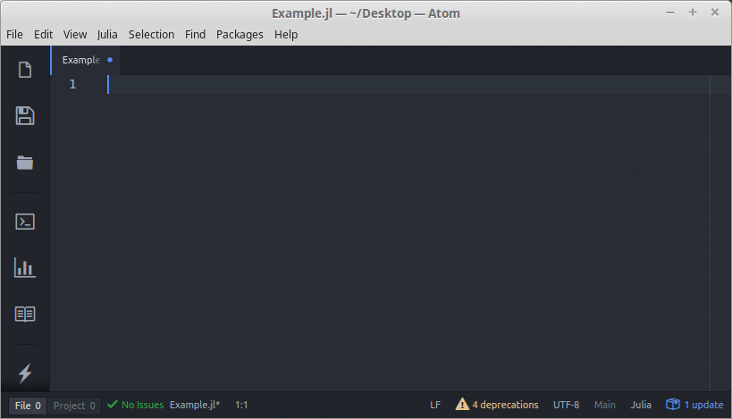

# linter-julia package

In order to use this package, you will need to start the lintserver, with following command:
```bash
julia -e "using Lint; lintserver(2223)"
```
To get Julia see: http://julialang.org/downloads/ and to get Lint.jl see: https://github.com/tonyhffong/Lint.jl#installation


